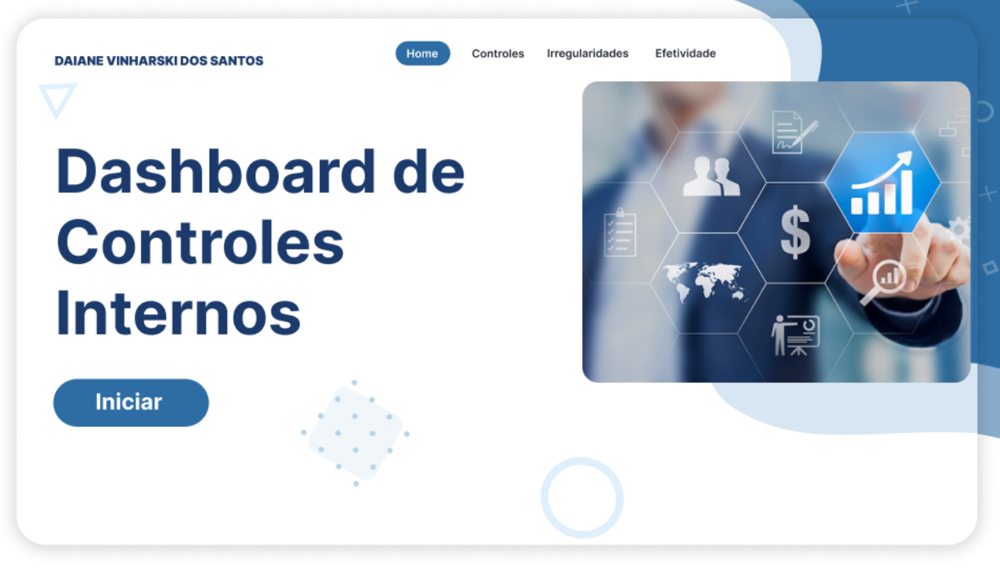
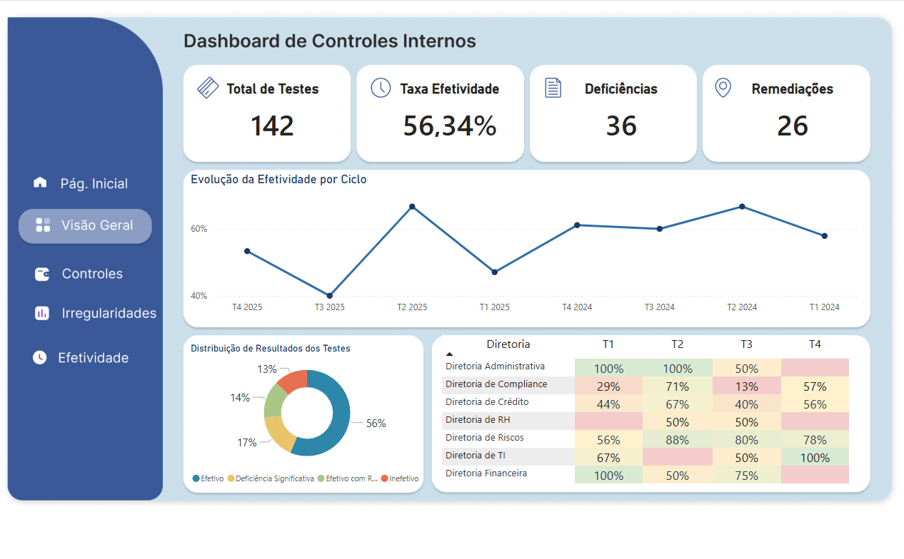
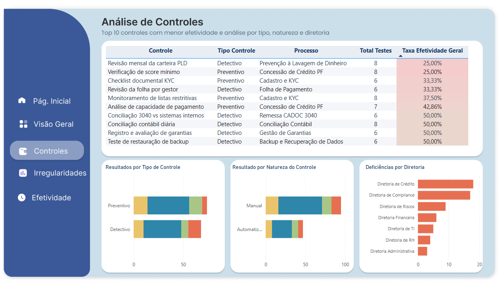
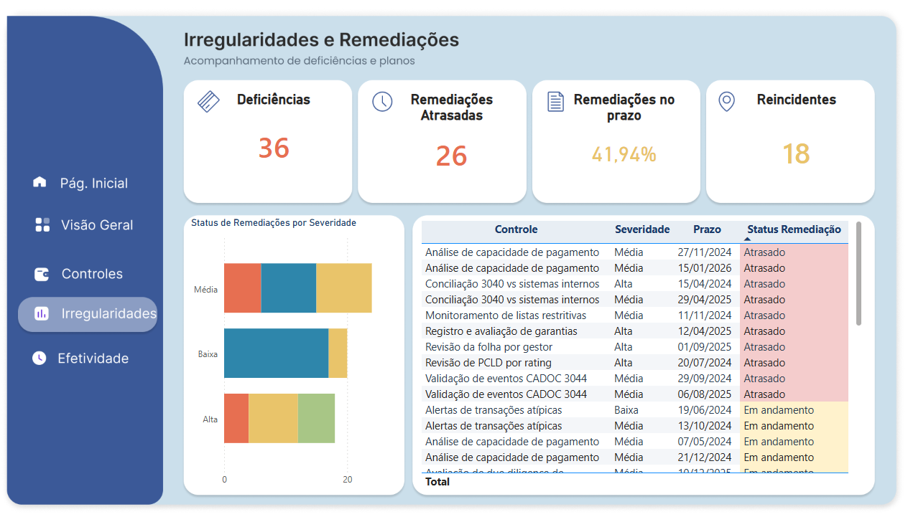
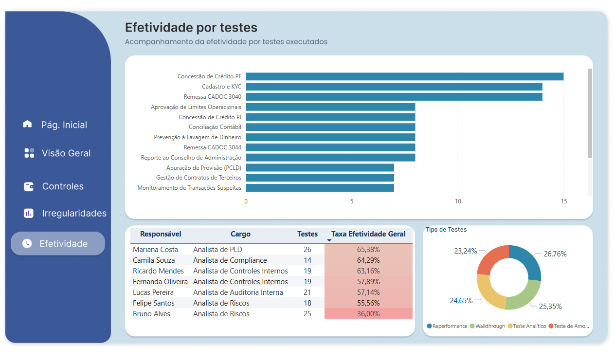

# 📊 Dashboard de Controles Internos
### Business Intelligence para Compliance no Setor Financeiro

> **Infraestrutura de Dados, Modelagem Relacional e Inteligência Analítica aplicadas à Gestão de Riscos e Controles Internos em Instituições Financeiras**

[](https://powerbi.microsoft.com)
[](https://learn.microsoft.com/dax)
[](https://python.org)
[](LICENSE)

---

## 🔎 Sobre o Projeto

Este repositório documenta a concepção, modelagem e implementação de um **Dashboard de Controles Internos** desenvolvido no Microsoft Power BI, com foco em instituições do setor financeiro brasileiro.

O projeto surge como resposta à crescente complexidade normativa do ambiente regulatório — **Resolução CMN nº 4.966/2021**, **Circular BCB nº 3.978/2020**, **Instruções Normativas BCB nº 393/2023 e nº 570/2024** — e demonstra que é possível transformar dados operacionais de compliance em inteligência analítica acionável com arquitetura simples e acessível.

> ⚠️ **Importante:** Todos os dados utilizados neste projeto são **inteiramente sintéticos**, gerados por algoritmos probabilísticos em Python. Eles foram calibrados para reproduzir padrões realistas de desempenho de controles internos, mas **não representam nenhuma instituição financeira real**.

---

## 🖥️ Prévia do Dashboard

### Página Inicial


### Visão Geral Executiva


### Análise de Controles


### Irregularidades e Remediações


### Efetividade por Testes


---

## 📐 Arquitetura de Dados — Star Schema

O modelo de dados segue a arquitetura dimensional em estrela (**star schema**), composta por **4 tabelas dimensionais** e **2 tabelas fato**:

```
dim_controle ──────────────────────────────────┐
dim_processo  ──────────────┐                  │
dim_auditor  ──────────────────────► fato_teste_controle ──► fato_plano_remediacao
dim_ciclo    ──────────────────────────────────┘
```

| Tabela | Descrição | Registros |
|---|---|---|
| `dim_controle` | 20 controles internos mapeados | 20 |
| `dim_processo` | 20 processos bancários por diretoria | 20 |
| `dim_auditor` | 8 auditores internos | 8 |
| `dim_ciclo` | 8 ciclos trimestrais (2024–2025) | 8 |
| `fato_teste_controle` | Registros de testes realizados | 142 |
| `fato_plano_remediacao` | Planos de remediação vinculados | 62 |

---

## 📊 As 4 Dimensões Analíticas do Dashboard

### 1. 🏠 Visão Executiva
Responde à pergunta: **qual é a saúde atual do ambiente de controles?**

| KPI | Valor | Benchmark |
|---|---|---|
| Total de Testes Realizados | **142** | — |
| Taxa de Efetividade Geral | **56,34%** | > 75% |
| Deficiências em Aberto | **36** | Tendência ↓ |
| Remediações Atrasadas | **26** | 0 (ideal) |

### 2. 🔬 Análise de Controles
Top 10 controles com menor efetividade, análise por tipo (preventivo vs. detectivo) e natureza (manual vs. automatizado).

- **Revisão Mensal da Carteira PLD** → 25,00% de efetividade
- **Verificação de Score Mínimo** → 25,00% de efetividade
- **Checklist Documental KYC** → 33,33% de efetividade

### 3. ⚠️ Irregularidades e Remediações
Painel operacional com acompanhamento de deficiências abertas, SLA de remediações e reincidências.

| KPI | Valor | Benchmark |
|---|---|---|
| Deficiências Abertas | **36** | — |
| Remediações Atrasadas | **26** | — |
| SLA de Remediações no Prazo | **41,94%** | > 85% |
| Controles Reincidentes | **18** | 0 (ideal) |

### 4. ⏱️ Efetividade por Testes
Produtividade por auditor, cobertura por processo e distribuição por tipo de teste (walkthrough, amostragem, analítico, reperformance).

| Responsável | Cargo | Testes | Taxa Efetividade |
|---|---|---|---|
| Mariana Costa | Analista de PLD | 26 | 65,38% |
| Camila Souza | Analista de Compliance | 14 | 64,29% |
| Ricardo Mendes | Analista de Controles Internos | 19 | 63,16% |
| Bruno Alves | Analista de Riscos | 25 | **36,00%** ⚠️ |

---

## ⚡ A Regra 20/80 para Dados de Compliance

Inspirado no **Princípio de Pareto**, o projeto demonstra que apenas **5 entidades de dados** — equivalentes a ~20% de uma arquitetura completa de GRC — são capazes de suportar **80% dos casos de uso analíticos** relevantes para gestores de compliance:

| Entidade | Campos Essenciais | Insights Gerados |
|---|---|---|
| **Controles Internos** | ID, nome, tipo, natureza, processo, frequência | Perfil do ambiente; preventivo vs. detectivo |
| **Processos / Áreas** | ID, nome, área, diretoria | Concentração de riscos por unidade |
| **Resultados de Testes** | ID controle, resultado, data, auditor, ciclo, desvios | Taxa de efetividade; reincidência |
| **Planos de Remediação** | ID teste, severidade, prazo, status, data conclusão | SLA; deficiências crônicas |
| **Ciclos de Teste** | ID, trimestre, ano, data início, data fim | Sazonalidade; tendências temporais |

---

## 📏 KPIs em DAX

O sistema incorpora **10 indicadores-chave** desenvolvidos em linguagem DAX:

```dax
// Exemplo — Taxa de Efetividade Geral
Taxa Efetividade Geral =
DIVIDE(
    COUNTROWS(FILTER(fato_teste_controle, fato_teste_controle[resultado_teste] = "Efetivo")),
    COUNTROWS(fato_teste_controle)
)

// Exemplo — SLA de Remediações
SLA Remediações =
DIVIDE(
    COUNTROWS(FILTER(fato_plano_remediacao,
        fato_plano_remediacao[data_conclusao] <= fato_plano_remediacao[prazo]
        && fato_plano_remediacao[status] = "Concluído")),
    COUNTROWS(fato_plano_remediacao)
)
```

| KPI | Benchmark |
|---|---|
| Taxa de Efetividade Geral | > 75% |
| Cobertura de Testes | 100% ao fim do ciclo |
| SLA de Remediações | > 85% |
| Controles Reincidentes | 0 (meta ideal) |
| Taxa de Desvios/Amostra | < 5% por controle |

---

## 🗂️ Estrutura do Repositório

```
📦 dashboard-controles-internos
 ┣ 📂 dados/
 ┃ ┣ 📄 dim_controle.csv
 ┃ ┣ 📄 dim_processo.csv
 ┃ ┣ 📄 dim_auditor.csv
 ┃ ┣ 📄 dim_ciclo.csv
 ┃ ┣ 📄 fato_teste_controle.csv
 ┃ ┗ 📄 fato_plano_remediacao.csv
 ┣ 📂 imagens/
 ┃ ┣ 🖼️ home.png
 ┃ ┣ 🖼️ visao_geral.png
 ┃ ┣ 🖼️ controles.png
 ┃ ┣ 🖼️ irregularidades.png
 ┃ ┗ 🖼️ efetividade.png
 ┣ 📄 Dashboard_Controles_Internos.pbix
 ┣ 📄 artigo.pdf
 ┗ 📄 README.md
```

---

## 🚀 Como Usar

### Pré-requisitos
- [Power BI Desktop](https://powerbi.microsoft.com/desktop/) (versão fevereiro/2026 ou superior)
- Python 3.10+ (opcional — para regenerar os dados sintéticos)

### Passos

1. **Clone o repositório**
```bash
git clone https://github.com/seu-usuario/dashboard-controles-internos.git
cd dashboard-controles-internos
```

2. **Abra o arquivo `.pbix`** no Power BI Desktop

3. **Atualize as fontes de dados** apontando para a pasta `dados/` local:
   - Página Inicial → Transformar Dados → Configurações da Fonte de Dados

4. **Atualize o modelo** clicando em *Atualizar* no Power BI Desktop

> Caso queira usar seus próprios dados, substitua os arquivos CSV na pasta `dados/` mantendo a mesma estrutura de colunas descrita no artigo.

---

## 📚 Referencial Teórico

- **COSO (2013)** — Internal Control — Integrated Framework
- **COSO (2017)** — Enterprise Risk Management: Integrating with Strategy and Performance
- **Kimball (1996)** — The Data Warehouse Toolkit (star schema)
- **Davenport & Harris (2007)** — Competing on Analytics
- **Hevner et al. (2004)** — Design Science in Information Systems Research (DSR)
- **Koch (1998)** — The 80/20 Principle

---

## 🏛️ Contexto Regulatório

O projeto endereça as exigências das seguintes normas brasileiras:

| Norma | Ementa |
|---|---|
| Resolução CMN nº 4.966/2021 | Classificação e mensuração de instrumentos financeiros |
| Circular BCB nº 3.978/2020 | Políticas de Prevenção à Lavagem de Dinheiro (PLD/FT) |
| Instrução Normativa BCB nº 393/2023 | Remessa CADOC 3040 ao Banco Central |
| Instrução Normativa BCB nº 570/2024 | Remessa CADOC 3044 ao Banco Central |

---

## ✍️ Autora

**Daiane dos Santos Vinharski**
Analista de Produtos Financeiros

[](https://linkedin.com/in/seu-perfil)
[](https://github.com/seu-usuario)

---

## 📄 Licença

Este projeto está licenciado sob a [MIT License](LICENSE).

---

> *"A transformação de dados operacionais de compliance em inteligência executiva não requer grandes investimentos em tecnologia, mas sim disciplina de coleta, padronização de domínios e modelagem relacional adequada."*
> — Daiane Vinharski, 2026
